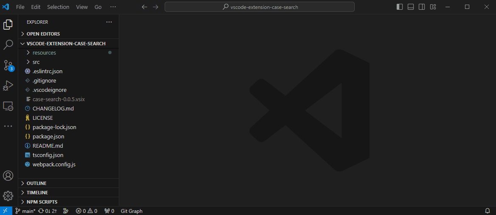

# Case Search

The extension based on native search component. It is used to search for multiple forms of presentation of your query string. Supports the following cases:

* kebab-case
* camelCase
* PascalCase
* snake_case
* UPPER_SNAKE_CASE

If no case is specified, it defaults to **all cases**.

## Usage

The fastest way to use it is to use shortcut keys `⌘+F1`. You can then select one or many appropriate cases from the drop-down options and input your query string for custom searching.

Also, The search box can be show up by invoking the command `Case Search: Search by case` from the Command Palette. The Command Palette can be invoked by the shortcut key `⇧+⌘+P`.

## **Enjoy!**
